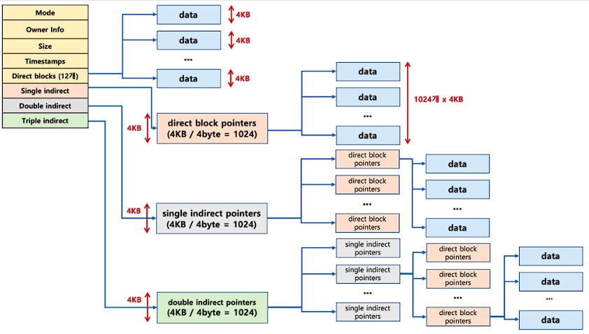

* buffer
  * IO가 일어날 때 데이터를 임시로 보관하는 저장소
  * 주로 메인 메모리의 일부
  * 크기는 해당 OS의 block 크기와 비례함
  * replacement policy 존재 - ex. LRU, LFU..
* inode
  * index node
  * 파일의 metadata 저장 - 파일 타입, 권한, 크기, data block 포인터 등
  * block pointer를 이용해 원하는 block으로 빠르게 접근할 수 있음
  * 파일이 생성되면 파일 시스템은 inode에 unique 한 숫자를 할당 - inode number
  * inode number로 파일을 식별함
  * 직접 data block을 가르키는 pointer는 개수가 제한돼있음 - 차이는 있지만 10개 언저리
  * single indirect, double indirect 방식으로 tree 구조로 제한된 크기의 inode에 많은 수의 pointer를 저장
    * single indirect의 경우, 포인터가 실제 data block을 가르키지 않고, 포인터를 저장한 data block을 가르킴
    * 포인터를 가지고 있는 data block은 실제 data block을 가르키는 포인터를 가지고 있음
    * 블록의 크키가 4KB, CPU의 word가 32bit라고 하면, single indirect로 종 1024개의 data block pointer를 저장할 수 있음
    * double indirect는 이중으로 돼있어서 총 1024^2개의 data block pointer 저장
  
* slotted page
  * data block안의 레코드의 정보를 효율적으로 관리하기 위한 방법
  * 헤더에 해당 data block의 레코드 정보를 저장, 헤더는 주로 block의 끝에 있음
    * 이 부분은 파일 시스템이나 DBMS에 따라 상이할 수 있음
  * 헤더는 레코드 수, 각 레코드의 크기, 블록의 빈 공간의 마지막 위치 정보 포함
* blocking factor
  * block 당 record 수
  * 즉, data block을 얼마나 컴팩트하게 사용하는지
  * 클수록 disk access 회수를 줄일 수 있음
  * storage utilization - blocking factor * record size / block size
    * 최대 1, 너무 1에 가까워지면 overflow 발생 확률 높아짐
* todo: static & dynamic hash, block overflow, external sort